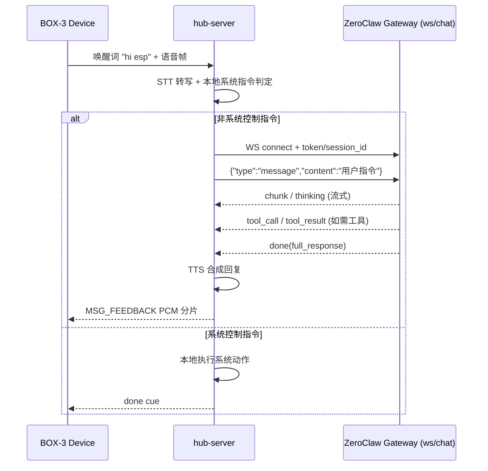

# CyberHub 与 ZeroClaw WebSocket 对接实现记录

## 1. 文档范围

本文只聚焦一件事：**CyberHub 如何把语音指令转发给 ZeroClaw，并通过 WebSocket 完成双向通信**。  
不展开 `webhook` 和 OpenAI-compatible 两种通道（当前未做完整验证）。

同时约束当前产品语义：**唤醒词只有 `hi esp`**，非系统控制类指令才会转发到 ZeroClaw。

---

## 2. 端到端流程（只保留主干）

1. 设备侧检测到唤醒词 `hi esp`，开始上传语音帧
2. `hub-server` 接收语音、切片并做 STT 转写
3. 服务端先做本地系统指令判定（锁屏、音量、静音等）
4. 如果不是系统控制指令，走 ZeroClaw `ws/chat`
5. ZeroClaw 在同一条 WebSocket 链路中返回流式事件（`tool_call` / `tool_result` / `chunk` / `done`）
6. `hub-server` 取 `done.full_response`，执行 TTS，下发音频反馈给设备

### 2.1 时序图（WebSocket 主链路）



---

## 3. 代码实现：如何与 ZeroClaw 建立对接

核心代码在：

- `hub-server/src/ai/mod.rs`
- `hub-server/src/config.rs`
- `hub-server/src/gateway/mod.rs`

### 3.1 设备数据进入 AI 处理

`gateway` 在收到 `MSG_VOICE_DATA` 或 `MSG_VOICE_END` 后，把切好的 wav 异步交给：

- `AiProcessor::process_utterance(wav_path, net)`

`net` 是设备 TCP 下行写端（后续回传 TTS 用）。

### 3.2 非系统控制指令进入 ZeroClaw

`process_utterance()` 会先走本地指令路由：

- `try_local_command(command)` 命中则本地执行并返回
- 未命中则进入 ZeroClaw 转发

当前主用模式是：

- `ZEROCLAW_MODE=ws`

即调用：

- `relay_zeroclaw_ws_chat(&final_command, &net)`

### 3.3 WebSocket URL 组装方式

`build_zeroclaw_ws_url()` 会把配置组装成：

- 基础地址：`ZEROCLAW_WS_CHAT_URL`（如 `ws://127.0.0.1:42617/ws/chat`）
- Query 参数：
  - `token=<ZEROCLAW_API_KEY>`
  - `session_id=<ZEROCLAW_WS_SESSION_ID>`（可选）
  - `name=<ZEROCLAW_WS_SESSION_NAME>`（可选）

最终连接形态：

```text
ws://127.0.0.1:42617/ws/chat?token=<token>&session_id=<sid>
```

### 3.4 双向通信如何实现

`relay_zeroclaw_ws_chat()` 的通信过程：

1. `connect_async(url)` 建立 WS
2. 等待服务端首个文本帧（通常 `session_start`）
3. 发送用户消息：
   - `{"type":"message","content":"<识别后的指令>"}`
4. 循环读取服务端帧并分类型处理：
   - `tool_call`：记录被调用工具及参数
   - `tool_result`：记录工具执行结果
   - `chunk/thinking`：流式中间输出（debug）
   - `done`：拿到 `full_response` 作为最终回答
5. 对 `Ping` 回 `Pong`，保持连接健康
6. 整轮设置超时保护（连接/首帧/turn）

这是一条真正的双向链路：**客户端主动发 message，服务端按事件流回推工具和文本结果**。

### 3.5 回传设备的实现

当 `done.full_response` 到达后：

1. 调 `speak_reply_and_feedback(reply, net)`
2. 本地 TTS 合成 PCM
3. 通过 `MSG_FEEDBACK` 分片发回设备
4. 若无文本或 TTS 不可用，发送 done cue，避免设备端等待卡住

---

## 4. ZEROCLAW_API_KEY 是什么，怎么生成

`ZEROCLAW_API_KEY` 不是模型厂商 API Key，而是 **ZeroClaw Gateway 配对后发放的 Bearer token**。

### 4.1 获取 pairing code

在 ZeroClaw 所在机器执行：

```bash
zeroclaw gateway get-paircode --new
```

### 4.2 用 pairing code 换 token

```bash
PAIR_CODE="<上一步配对码>"
curl -sS -X POST \
  -H "X-Pairing-Code: ${PAIR_CODE}" \
  "http://127.0.0.1:42617/pair"
```

响应 JSON 会返回 `token` 字段。

### 4.3 配置到 hub-server

写入 `hub-server/.env`：

```env
ZEROCLAW_API_KEY=<token>
ZEROCLAW_MODE=ws
ZEROCLAW_WS_CHAT_URL=ws://127.0.0.1:42617/ws/chat
```

之后 `hub-server` 会把这个 token 自动带到 `ws/chat` 的 query 参数里。

---

## 5. 本次联调问题与定位记录

### 5.1 现象

语音“查询天气”时，ZeroClaw 返回的是“我将查询天气 + function JSON 文本”，没有真实天气数据。

### 5.2 关键日志特征

- 有 `[ZeroClaw] ...` 文本回复
- 但没有 `[ZeroClaw/tool] call ...` 和 `[ZeroClaw/tool] result ...`

这说明该轮没有触发真实工具执行事件。

### 5.3 根因

`ws/chat` 会按 `session_id` 恢复历史上下文。固定旧 `session_id` 时，会继承旧上下文行为，可能出现“只描述工具，不真正执行工具”。

### 5.4 解决

更换 `session_id` 后恢复正常（日志出现 `tool_call/tool_result`），说明问题在会话污染而非工具不可用。

已在代码中调整默认行为：

- 未显式设置 `ZEROCLAW_WS_SESSION_ID` 时，`hub-server` 每次启动自动生成新 `session_id`
- 需要长期记忆时，才手动指定固定 `session_id`

---

## 6. 建议的稳定配置（当前项目）

```env
ZEROCLAW_MODE=ws
ZEROCLAW_WS_CHAT_URL=ws://127.0.0.1:42617/ws/chat
ZEROCLAW_API_KEY=<pair 后返回的 token>
# ZEROCLAW_WS_SESSION_ID=   # 建议默认不固定，服务重启自动新会话
```

排障建议日志级别：

```bash
RUST_LOG=hub_server::ai=debug,hub_server::zeroclaw=debug,info
```

重点观察：

- `session_start` 是否 `resumed=true`
- 是否出现 `tool_call` / `tool_result`
- `done.full_response` 是否是最终可用答复

---

## 7. 结论

当前 CyberHub 与 ZeroClaw 的核心能力已经跑通，关键点在于：

1. 非系统控制指令通过 `ws/chat` 转发
2. 使用配对获得的 `ZEROCLAW_API_KEY` 完成鉴权
3. 通过 WebSocket 事件流实现双向通信与工具执行可观测
4. 通过 session 管理（启动生成新 session）规避历史会话污染

以上流程即本项目当前可复用、可排障、可扩展的对接基线。

# CyberHub 语音唤醒到 ZeroClaw 转发与双向通信实现说明

## 1. 目标与整体架构

本文整理了 CyberHub 在「语音唤醒后，服务端解析并转发到 ZeroClaw」这一链路中的完整实现过程，包括：

- 设备到服务端的语音数据流
- 服务端本地指令路由与 ZeroClaw 转发策略
- 与 ZeroClaw 的双向数据通信方式（WebSocket / Webhook / OpenAI-compatible）
- 实际排障中遇到的问题与解决方案

核心链路如下：

1. BOX-3 通过 TCP 帧协议发送唤醒、音频数据、结束信号到 `hub-server`
2. `hub-server` 进行语音切片/落盘，执行 STT 转写
3. 经过唤醒词与指令窗口判定，得到最终命令文本
4. 优先命中本地系统控制指令（锁屏/音量/静音等）
5. 本地未命中则转发到 ZeroClaw（优先 `ws/chat`）
6. ZeroClaw 返回文本（及工具事件）；服务端将回复做 TTS 后通过 TCP 下行到设备

---

## 2. 设备到服务端：语音数据接入与会话管理

入口在 `hub-server/src/gateway/mod.rs` 的 `handle_device_connection()`。

### 2.1 TCP 帧解析

服务端持续读取设备数据，按 `0x5A` 头 + type + payload_len + payload 解包：

- `MSG_VOICE_START`：语音会话开始，触发 `notify_wakeup()` 并开启音频会话
- `MSG_VOICE_DATA`：持续音频数据，交给 `AudioProcessor`；若切分出可转写音频则异步提交给 AI 处理
- `MSG_VOICE_END`：语音会话结束，做最终切分并提交 AI 处理
- `MSG_FLIP_EVENT`：本地锁屏快捷事件，直接触发系统控制

### 2.2 异步处理模型

每段可转写音频会通过 `tokio::spawn` 异步调用 `ai_processor.process_utterance(...)`，避免阻塞网关主读循环。

---

## 3. 服务端语义判定：本地命令优先，ZeroClaw 兜底

入口在 `hub-server/src/ai/mod.rs` 的 `process_utterance()`。

### 3.1 STT 转写

支持两种模式：

- 本地 `whisper-rs`（`USE_INTERNAL_STT=true`）
- 外部 API 转写（`USE_INTERNAL_STT=false`）

### 3.2 唤醒与指令窗口

实现了两套唤醒策略：

- 精确关键词（如“知行社”“你好”）
- “小 + zhì/zhī 音近字”动态匹配（容错 STT 同音误识别）

并维护 8 秒待命窗口：

- 命中唤醒词后刷新窗口
- 窗口内无唤醒词也可直接把整句作为指令
- 窗口外且无唤醒词则拒绝执行

### 3.3 本地系统指令优先

`try_local_command()` 会优先处理无需联网的系统控制：

- 锁屏
- 静音/取消静音
- 音量增减（语义词组合）

如果本地命中，立即下发完成提示，不再请求 ZeroClaw。

---

## 4. ZeroClaw 转发策略与三种通道

配置在 `hub-server/src/config.rs`，核心变量：

- `ZEROCLAW_MODE`：`auto | ws | webhook | openai`
- `ZEROCLAW_WS_CHAT_URL`
- `ZEROCLAW_WEBHOOK_URL`
- `ZEROCLAW_URL`（OpenAI-compatible `/v1`）
- `ZEROCLAW_API_KEY`
- `ZEROCLAW_WS_SESSION_ID`

### 4.1 Auto 模式

`Auto` 下按顺序尝试：

1. `ws/chat`
2. `webhook`
3. OpenAI-compatible chat completions

任一成功即返回。

### 4.2 `ws/chat`（推荐，支持工具）

`relay_zeroclaw_ws_chat()` 的关键点：

- 连接：`connect_async(ws_url?token=...&session_id=...)`
- 首帧等待：容忍 Ping，期望收到 `session_start` 文本帧
- 发送请求：`{"type":"message","content":"..."}`
- 持续读取服务端帧并处理：
  - `tool_call`：记录工具调用
  - `tool_result`：记录工具结果
  - `chunk/thinking`：流式内容
  - `done`：读取 `full_response`，作为最终回复
- 读写双向保活：收到 Ping 回 Pong
- 超时保护：连接超时、首帧超时、整轮 300s 超时

这就是与 ZeroClaw 的主要双向数据通信实现：同一个 WebSocket 连接上，客户端发消息，服务端流式回传文本与工具事件。

### 4.3 `webhook`（简单对话，不含工具）

`relay_zeroclaw_webhook()` 走 HTTP POST：

- 请求体 `{ "message": "..." }`
- 支持 Bearer 与可选 `X-Webhook-Secret`
- 解析响应 `response` 字段作为文本回复

该模式通常不承载 agent 工具执行流，只适合纯文本问答。

### 4.4 OpenAI-compatible（兼容兜底）

`relay_zeroclaw_openai()` 通过 `async-openai` 调 `/v1/chat/completions`：

- 构造标准 ChatCompletions 请求
- 读取首个 choice 的 `message.content`

同样偏文本通道，不是最优工具通路。

---

## 5. 服务端到设备：回复下行与反馈闭环

当 ZeroClaw 得到回复文本后，服务端会：

1. 调 `speak_reply_and_feedback()`
2. 将文本做本地 TTS（`say+ffmpeg` 或 `piper`）
3. 以 `MSG_FEEDBACK` 分片下发 PCM 到设备
4. 若 TTS 关闭或失败，则发送「done cue」包，避免设备端卡等待

这构成了完整闭环：设备上行语音 -> 服务端解析/转发 -> ZeroClaw 处理 -> 服务端下行语音反馈。

---

## 6. 实际遇到的问题与排障过程

### 问题现象

语音请求“查询天气”时，服务端打印的 ZeroClaw 回复是：

- “我将帮你查询天气”
- 并附带文本中的 function JSON
- 但没有返回真实天气结果

即：看起来像“说要调用工具”，却没有真正执行工具。

### 初步判断

从日志可见没有 `"[ZeroClaw/tool] call"` / `"[ZeroClaw/tool] result"`，说明这轮 `ws/chat` 流中未出现工具事件帧。

### 关键验证

在 ZeroClaw 自己的聊天界面里同样提问，工具可正常返回真实天气，说明：

- 工具本身可用
- 主要差异在 hub-server 的会话上下文/路由行为

### 根因定位

`ws/chat` 会按 `session_id` 续接历史会话。固定老 `session_id` 时，可能继承“坏上下文/坏行为模式”，导致模型只输出函数意图文本，不触发实际工具执行链。

### 解决方案

1. 排障阶段强制 `ZEROCLAW_MODE=ws`，避免 Auto 回退干扰
2. 更换 `session_id` 验证；更换后工具调用恢复正常
3. 代码层已调整默认策略：若未显式配置 `ZEROCLAW_WS_SESSION_ID`，服务端启动时自动生成新的 session id（每次启动新会话）

这显著降低了历史会话污染导致的“只说不做”概率。

---

## 7. 推荐运行与配置实践

### 7.1 推荐模式

- 优先使用 `ZEROCLAW_MODE=ws`（明确走工具通道）
- 仅在明确需要时再使用 `webhook/openai`

### 7.2 session 策略

- 默认：不写固定 `ZEROCLAW_WS_SESSION_ID`，让服务每次启动自动生成
- 如需长期多轮记忆，再显式设置固定值

### 7.3 日志建议

排障时打开：

```bash
RUST_LOG=hub_server::ai=debug,hub_server::zeroclaw=debug,info
```

重点观察：

- `session_start` 是否 `resumed=true`
- 是否出现 `tool_call` / `tool_result`
- 是否只收到 `done.full_response` 的“伪函数文本”

---

## 8. 一句话总结

CyberHub 这条链路本质上是「本地快速控制优先 + ZeroClaw 智能兜底」。其中 `ws/chat` 是实现双向流式与工具调用的关键通道，而 `session_id` 管理是稳定性关键点：不当复用会话会导致行为漂移，启动时自动生成新 session 可有效规避该问题。

